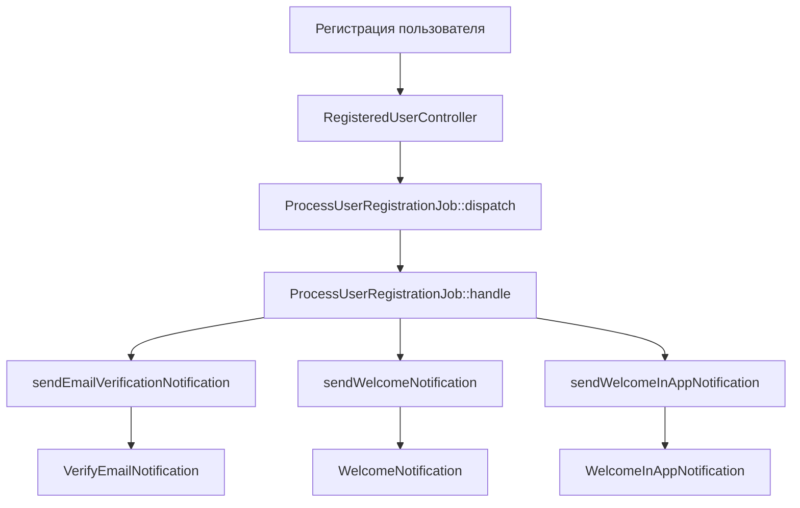
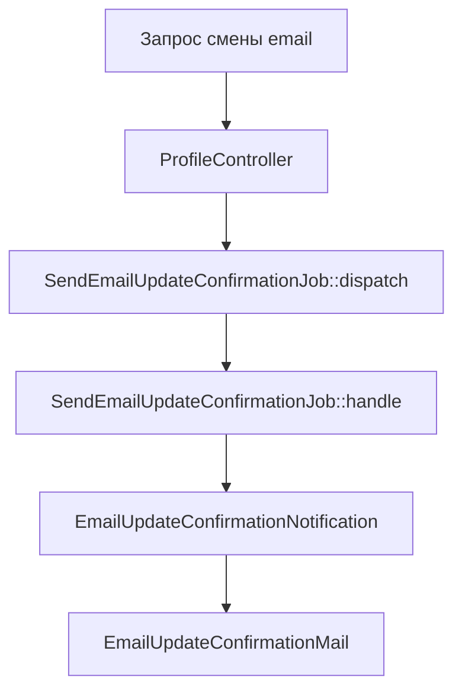
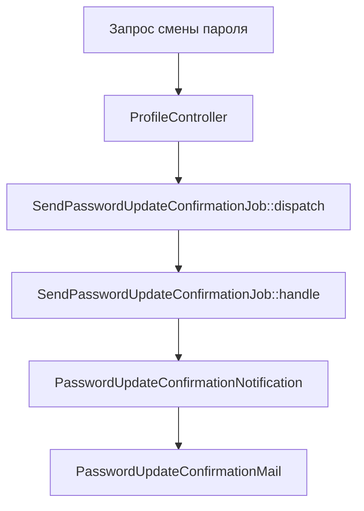

# Система уведомлений, почты и Jobs в Spy.House

## Обзор архитектуры

Система построена на трех основных компонентах:

- **Notifications** - внутриприложенческие уведомления (база данных)
- **Mail** - почтовые отправления
- **Jobs** - фоновые задачи для асинхронной обработки

## Архитектура компонентов

### 1. Notifications (Уведомления)

#### Структура папок:

```
app/Notifications/
├── CustomNotification.php              # Универсальное уведомление
├── WelcomeInAppNotification.php         # Приветственное уведомление
├── Auth/
│   ├── EmailVerifiedNotification.php   # Email подтвержден
│   ├── VerifyEmailNotification.php     # Подтверждение email
│   └── WelcomeNotification.php         # Приветственное (email)
├── Profile/
│   ├── EmailUpdateConfirmationNotification.php     # Подтверждение смены email
│   ├── EmailUpdatedNotification.php               # Email изменен
│   └── PasswordUpdateConfirmationNotification.php # Подтверждение смены пароля
└── Landings/
    └── WebsiteDownloadStatus.php       # Статус скачивания сайта
```

#### Базовые классы:

**CustomNotification** - универсальный класс для простых уведомлений:

```php
use App\Notifications\CustomNotification;
use App\Enums\Frontend\NotificationType;

// Создание уведомления
$notification = new CustomNotification(
    NotificationType::WELCOME,
    ['user_id' => $user->id],
    'Добро пожаловать!',
    'Спасибо за регистрацию'
);

$user->notify($notification);
```

**Специализированные классы** - для сложной логики:

```php
// Уведомление с кастомной логикой
class WelcomeInAppNotification extends Notification implements ShouldQueue
{
    public function toDatabase(object $notifiable): array
    {
        return [
            'title' => __('notifications.welcome.title'),
            'message' => __('notifications.welcome.message', [
                'name' => $notifiable->name ?? $notifiable->login
            ]),
            'type' => NotificationType::WELCOME->value,
            'icon' => 'welcome',
            'data' => [
                'registration_date' => $notifiable->created_at->format('Y-m-d H:i:s'),
                'user_id' => $notifiable->id
            ],
        ];
    }
}
```

### 2. Mail (Почтовые отправления)

#### Структура:

```
app/Mail/
├── WelcomeMail.php                     # Приветственное письмо
├── VerifyEmailMail.php                 # Подтверждение email
├── EmailUpdateConfirmationMail.php     # Подтверждение смены email
└── PasswordUpdateConfirmationMail.php  # Подтверждение смены пароля
```

#### Примеры Mail классов:

**Простой Mail класс:**

```php
class WelcomeMail extends Mailable
{
    use Queueable, SerializesModels;

    public function __construct(
        private readonly User $user
    ) {}

    public function build()
    {
        return $this->view('emails.welcome')
            ->subject('Welcome to Partners.House!')
            ->with(['user' => $this->user]);
    }
}
```

**Mail с кодом подтверждения:**

```php
class VerifyEmailMail extends Mailable
{
    public function __construct(
        private readonly int $code
    ) {}

    public function build()
    {
        return $this->view('emails.verify-email')
            ->subject('Account Verification - Spy.House')
            ->with(['code' => $this->code]);
    }
}
```

### 3. Jobs (Фоновые задачи)

#### Структура:

```
app/Jobs/
├── ProcessUserRegistrationJob.php      # Обработка регистрации пользователя
├── SendEmailUpdateConfirmationJob.php  # Отправка подтверждения смены email
├── SendPasswordUpdateConfirmationJob.php # Отправка подтверждения смены пароля
└── Landings/
    └── DownloadWebsiteJob.php          # Скачивание сайта
```

#### Примеры Jobs:

**Комплексная обработка регистрации:**

```php
class ProcessUserRegistrationJob implements ShouldQueue
{
    protected User $user;
    protected array $metadata;

    public function handle(): void
    {
        // 1. Отправка email верификации
        if (!$this->user->hasVerifiedEmail()) {
            $this->user->sendEmailVerificationNotification();
        }

        // 2. Отправка приветственного email
        $this->user->sendWelcomeNotification();

        // 3. Отправка приветственного уведомления в приложение
        $this->user->sendWelcomeInAppNotification();
    }
}
```

**Специализированная отправка:**

```php
class SendEmailUpdateConfirmationJob implements ShouldQueue
{
    protected User $user;
    protected string $verificationCode;
    protected string $newEmail;

    public function handle(): void
    {
        $this->user->notify(
            new EmailUpdateConfirmationNotification($this->verificationCode)
        );
    }
}
```

## Сервисы и вспомогательные классы

### NotificationDispatcher

Сервис для быстрой отправки простых уведомлений (только database канал):

```php
use App\Services\Notification\NotificationDispatcher;
use App\Enums\Frontend\NotificationType;

// Быстрая отправка без создания отдельного класса
NotificationDispatcher::quickSend(
    $user,                              // Пользователь
    NotificationType::SUCCESS,          // Тип уведомления
    ['action' => 'profile_updated'],    // Дополнительные данные
    'Профиль обновлен',                 // Кастомный заголовок (опционально)
    'Изменения сохранены успешно'       // Кастомное сообщение (опционально)
);

// Простая отправка только с типом
NotificationDispatcher::quickSend(
    $user,
    NotificationType::WELCOME
);
```

### UserNotificationService

Сервис для отправки различных типов уведомлений:

```php
$service = new UserNotificationService();

// Отправка email подтверждения
$service->sendEmailVerification($user);

// Отправка приветственного письма
$service->sendWelcomeEmail($user);

// Отправка подтверждения смены пароля
$service->sendPasswordUpdateConfirmation($user, $code);
```

## Потоки данных и взаимодействия

### 1. Регистрация пользователя



### 2. Смена email



### 3. Смена пароля



## Конфигурация и каналы

### Каналы уведомлений:

1. **database** - внутриприложенческие уведомления (для пользователей)
2. **mail** - email отправления

### Типы уведомлений (NotificationType enum):

- `WELCOME` - приветственные
- `EMAIL_VERIFIED` - подтверждение email
- `PASSWORD_CHANGED` - смена пароля
- `EMAIL_CHANGED` - смена email
- `DOWNLOAD_COMPLETED` - завершение скачивания
- `DOWNLOAD_FAILED` - ошибка скачивания

## Очереди и производительность

### Все асинхронные компоненты используют queues:

```php
// Jobs автоматически ставятся в очередь
implements ShouldQueue

// Notifications ставятся в очередь при необходимости
class WelcomeNotification extends Notification implements ShouldQueue
{
    use Queueable;
}

// Mail может быть поставлен в очередь
Mail::to($user)->queue(new WelcomeMail($user));
```

### Обработка ошибок:

```php
public function failed(\Throwable $exception): void
{
    Log::error('Job failed permanently', [
        'user_id' => $this->user->id,
        'error' => $exception->getMessage(),
    ]);
}
```

## Примеры использования

### Отправка простого уведомления:

```php
// Через диспетчер (только in-app уведомления)
NotificationDispatcher::quickSend(
    $user,
    NotificationType::INFO,
    ['action' => 'profile_updated'],
    'Информация',
    'Ваш профиль обновлен'
);

// Напрямую через CustomNotification
$user->notify(new CustomNotification(
    NotificationType::SUCCESS,
    ['message' => 'Операция выполнена'],
    'Успех',
    'Операция выполнена успешно'
));

// Специализированное уведомление
$user->notify(new WelcomeInAppNotification());
```

### Отправка email с очередью:

```php
// Через Job (рекомендуемый способ)
SendEmailUpdateConfirmationJob::dispatch($user, $code, $newEmail);

// Напрямую
Mail::to($user)->send(new WelcomeMail($user));
```

### Комплексная обработка:

```php
// Диспетчеризация сложной логики
ProcessUserRegistrationJob::dispatch($user, [
    'source' => 'web',
    'utm_campaign' => 'summer2024'
]);
```

## Логирование и мониторинг

Все компоненты системы логируют свою работу:

```php
Log::debug('Sending email verification notification', ['user_id' => $user->id]);
Log::info('Welcome email sent', ['user_id' => $user->id]);
Log::error('Failed to send notification', ['error' => $e->getMessage()]);
```

## Рекомендации по использованию

### Когда использовать что:

1. **CustomNotification** - для простых внутриприложенческих уведомлений
2. **Специализированные Notification классы** - для сложной логики или когда нужен контроль
3. **Mail классы** - для всех email отправлений
4. **Jobs** - для асинхронной обработки и комплексных операций
5. **NotificationDispatcher** - для быстрых разовых уведомлений
6. **UserNotificationService** - для стандартных операций с уведомлениями

### Best Practices:

1. **Всегда использовать очереди** для email и сложных уведомлений
2. **Логировать** все важные операции
3. **Обрабатывать ошибки** в Jobs через метод `failed()`
4. **Использовать enum** для типов уведомлений
5. **Группировать** связанные уведомления по папкам (Auth, Profile, etc.)

## Миграции и база данных

### Таблица notifications:

```sql
CREATE TABLE notifications (
    id char(36) NOT NULL,
    type varchar(255) NOT NULL,
    notifiable_type varchar(255) NOT NULL,
    notifiable_id bigint unsigned NOT NULL,
    data text NOT NULL,
    read_at timestamp NULL,
    created_at timestamp NULL,
    updated_at timestamp NULL
);
```

### Очереди (jobs table):

```sql
CREATE TABLE jobs (
    id bigint unsigned NOT NULL AUTO_INCREMENT,
    queue varchar(255) NOT NULL,
    payload longtext NOT NULL,
    attempts tinyint unsigned NOT NULL,
    reserved_at int unsigned NULL,
    available_at int unsigned NOT NULL,
    created_at int unsigned NOT NULL
);
```

Система спроектирована для обеспечения надежности, масштабируемости и простоты поддержки.
